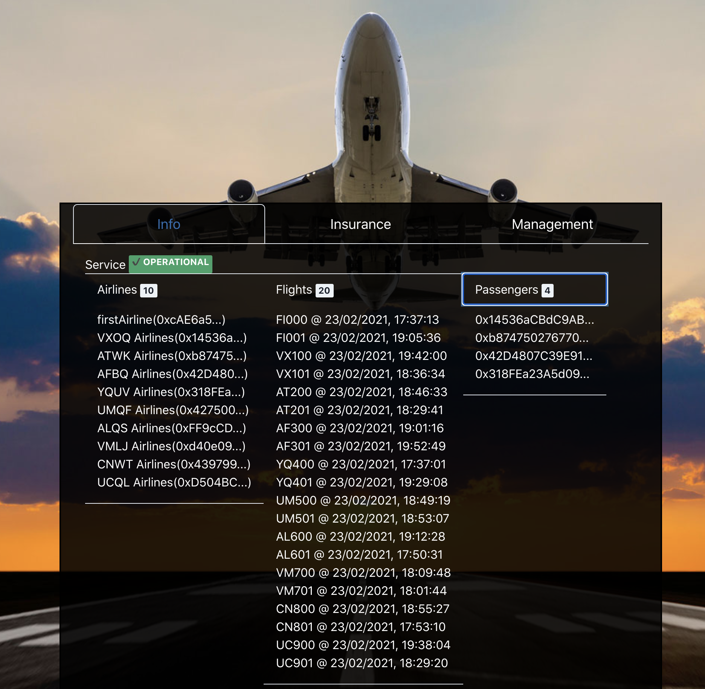
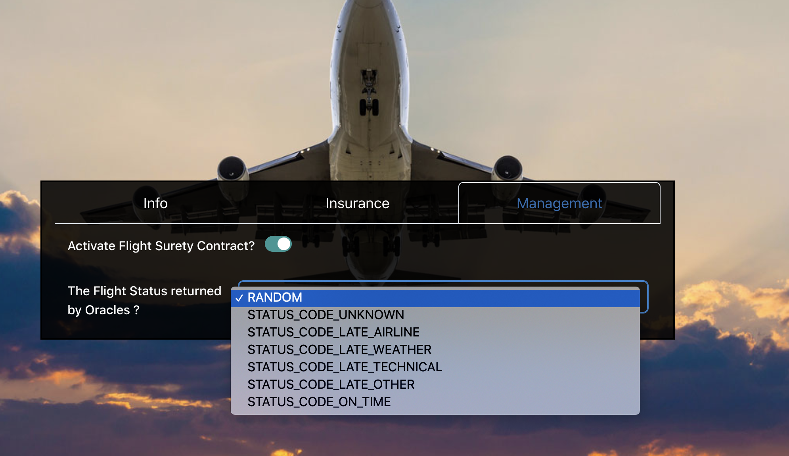
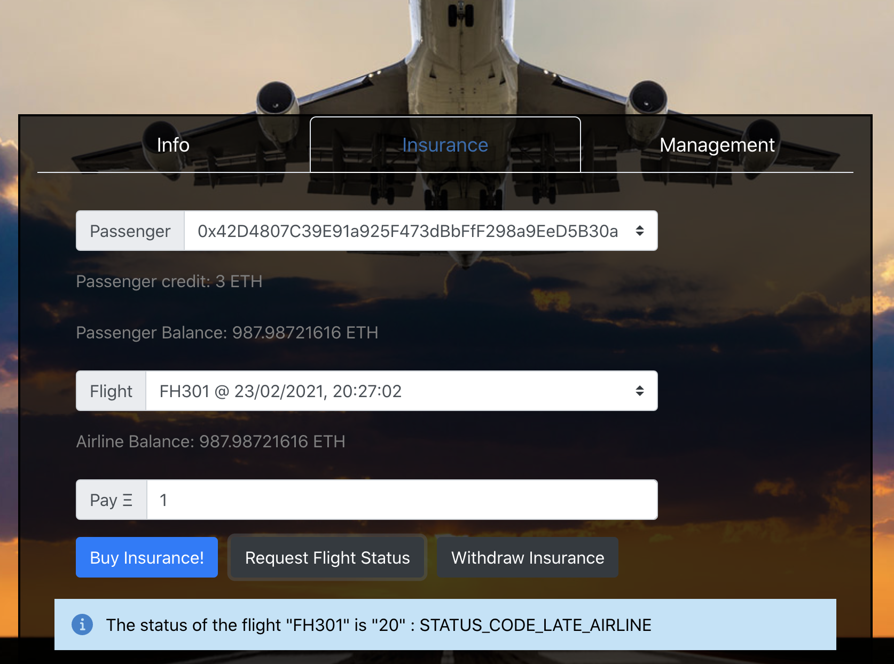
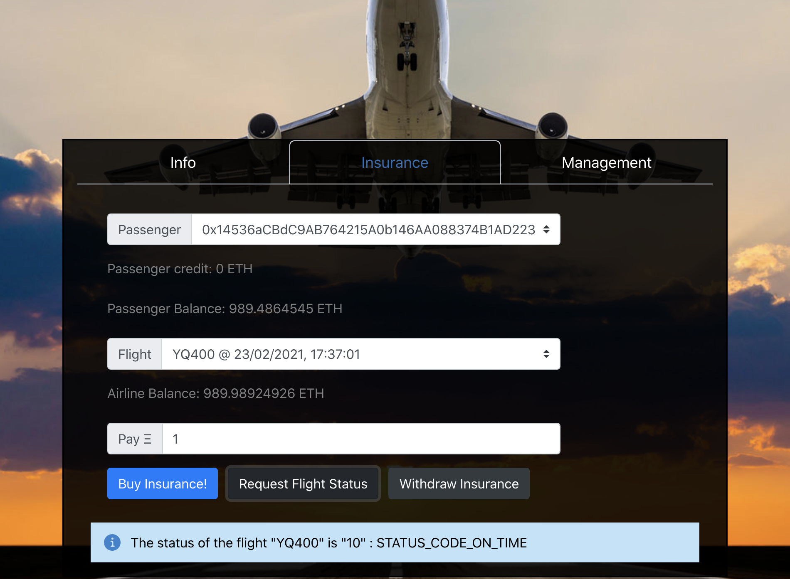
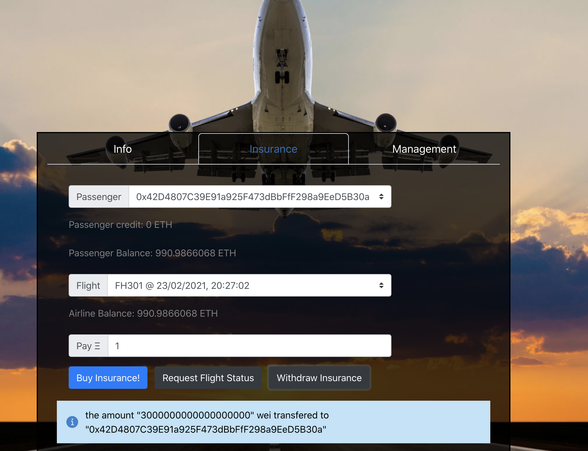

# FlightSurety

FlightSurety is a sample application project for Udacity's Blockchain course.

## Versions 

- Truffle v5.1.61 
- Solidity - 0.6.12 
- Node v15.5.1
- Web3.js v1.2.9
- Ganache v1.2.3

## Install

This repository contains Smart Contract code in Solidity (using Truffle), tests (also using Truffle), dApp scaffolding (using React, Chakra-U ) and server app scaffolding.

To install, download or clone the repo, then:

1. `npm install`
2. `npm --prefix ./src/dapp install ./src/dapp`

`truffle compile`

## Develop Client

To run truffle tests:
1. `./start-ganache.sh`
2.  In another Terminal : 
    - `truffle test ./test/flightSurety.js`
    - `truffle test ./test/oracles.js`
    - `truffle test ./test/oracleLate.js`
    - `truffle test ./test/oraclesOnTime.js`

To use the server and dapp :

1. `./start-ganache.sh`
2. `truffle migrate --reset` ( another Terminal)
3. `npm run server`
4. `./start-dapp.sh`

The server is used for 3 purposes :
* Register oracles
* Reigstering a list of Airlines in the FlightSurety contract (in the startup)
* Serve an API, to retrieve flights list  and to  manage the flight status returned by the oracles ( for simulation purpose)

To view dapp:

`http://localhost:8000`

## Dapp Snappshots

### Info Tab

* All  the registered Airlines, retrieved by calling the FlightSuretyApp (smart contract )

* The flights list is retrieved from the backend server

* The passenger accounts ( from  the truffle config)

### Management Tab
* It is used to disable or enable the FlightSuretyApp smart contract 

*  And to set the  flight status that will be retrieved by the registered oracles

* After disabling the contract, the airlines list could not be fetched anymore

### Insurance Tab 
* From this tab the user can buy the insurance , open request to check the flight status and  pay out the insurance

* Case :The flight is late

* Case : The flight is on time 

* Withdraw the insurance : pay out the passenger 

## Resources

* [How does Ethereum work anyway?](https://medium.com/@preethikasireddy/how-does-ethereum-work-anyway-22d1df506369)
* [BIP39 Mnemonic Generator](https://iancoleman.io/bip39/)
* [Truffle Framework](http://truffleframework.com/)
* [Ganache Local Blockchain](http://truffleframework.com/ganache/)
* [Remix Solidity IDE](https://remix.ethereum.org/)
* [Solidity Language Reference](http://solidity.readthedocs.io/en/v0.4.24/)
* [Ethereum Blockchain Explorer](https://etherscan.io/)
* [Web3Js Reference](https://github.com/ethereum/wiki/wiki/JavaScript-API)